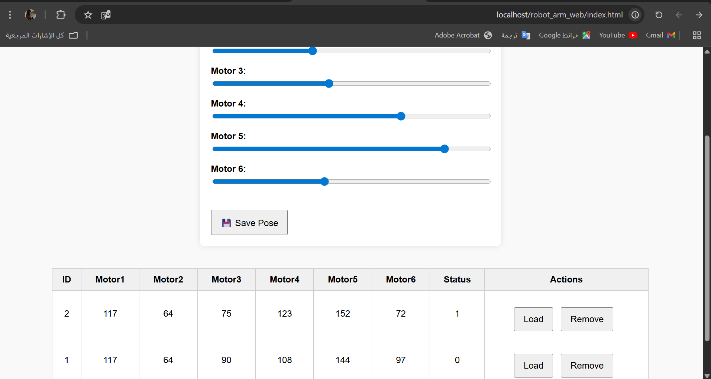

# Robot Arm Control Panel

مشروع بسيط للتحكم في ذراع روبوت باستخدام واجهة ويب.

## 💻 التقنيات المستخدمة:
- HTML
- CSS
- JavaScript
- PHP
- MySQL
- XAMPP

## 🛠️ وظيفة المشروع:
- تحريك 6 محركات تمثل مفاصل الذراع الروبوتي باستخدام منزلقات (sliders).
- حفظ الوضع الحالي للمحركات في قاعدة البيانات.
- عرض جميع الحركات المحفوظة في جدول.
- إمكانية تحميل (Load) أو حذف (Remove) أي حركة.
- إمكانية تعيين الحالة إلى 0 باستخدام ملف `update_status.php`.

## 📂 ملفات المشروع:
- `index.html`: واجهة المستخدم.
- `style.css`: تنسيقات الواجهة.
- `db.php`: الاتصال بقاعدة البيانات.
- `submit.php`: لحفظ الوضع الجديد.
- `fetch.php`: لجلب البيانات.
- `update.php`: لتحديث الحالة.
- `update_status.php`: لتغيير الحالة إلى 0.
- `get_run_pose.php`: (ملف اختياري حسب الحاجة).
- مجلد `images/`: يحتوي على صورة توضح واجهة المشروع.

## 🖼️ صورة الواجهة:

## 📝 الملاحظات:
- تمت تجربة المشروع محليًا باستخدام `XAMPP`.
- قاعدة البيانات باسم `robot_arm_db` وجدول `poses`.